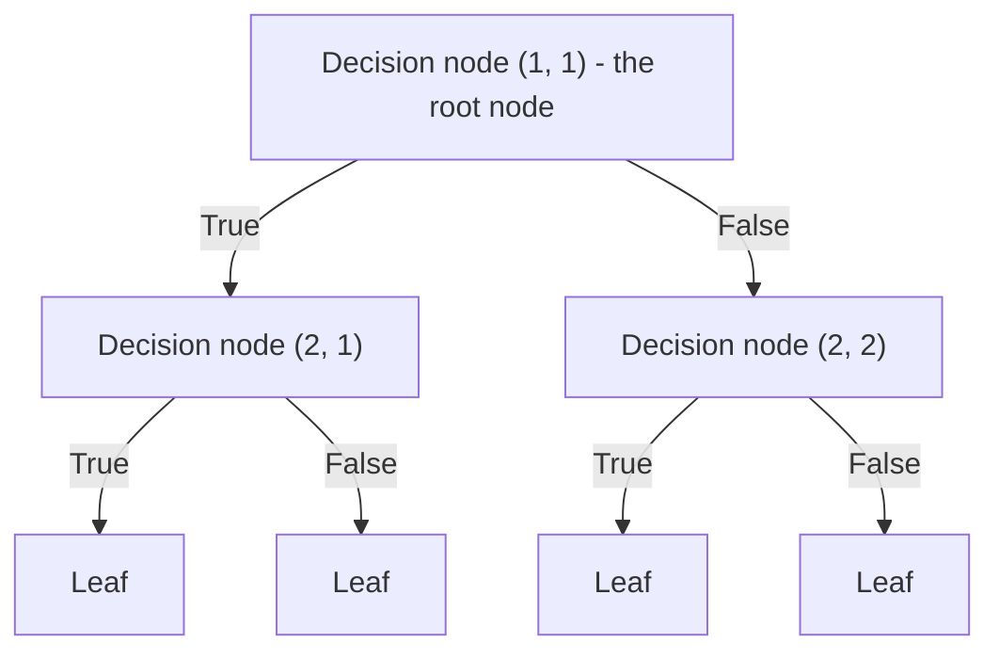

Tags: [[__Machine_Learning]]

# Introduction
Decision Tree is a model used for classification, regression and clustering.

It can take as input continuous, categorical and mix of continuous and categorical variables.
# Decision Tree architecture
Decision Tree looks like that:

# Parent, child nodes and leaves
A node in a decision tree can be connected to two other nodes:
- The node above is called the **parent node**.
- The nodes below, linked to the parent node, are called its **child nodes**.

If a node has no child nodes, it is called a **leaf node**.
# Going through a tree and splitting condition
Process of going through a tree, from the root node to the leaf, also called '**traversal**', looks like that:
1. Take a data sample and go to the first decision node (the root node)
2. Check if the sample satisfies the condition assigned to the node, so called 'splitting condition':
	- If it does, then go to the left child node
	- Otherwise, go to the right child node
3. Continue the process for every further node until the leaf node is reached

As already mentioned, every node has assigned a splitting condition which determines to which child node data sample should go next.

For example our dataset can look like that:
$$
\begin{array}{c|c|c|c}
\text{Gender} & \text{Economic status} & \text{Age} & \text{Has disease} \\ \hline
\text{Male} & \text{High} & 40 & \text{No} \\
\text{Female} & \text{Medium} & 25 & \text{Yes} \\
\text{Male} & \text{Low} & 30 & \text{No} \\
\end{array}
$$
And the splitting condition in a decision node can look for example like that:
- $\text{Economic status} = \text{Medium}$
- $\text{Age} > 30$
# Datasets corresponding to nodes and splitting datasets
Every node corresponds to a specific subset of the training dataset. It contains samples that satisfies all the splitting conditions along the path from the root to that node.

When we take a dataset and go to the root node (1, 1), that node's splitting condition splits the dataset into two parts:
- Subset that satisfies the condition - assigned to the left child node (2, 1)
- Subset that doesn't satisfy the condition - assigned to the right child node (2, 2)
# Links
Video with a great explanation of this model: https://www.youtube.com/watch?v=_L39rN6gz7Y
# Decision tree model formula
Decision tree model formula can be written as:
$$
f(x) = 
\begin{cases}
c_1,\text{ if } x \in \mathcal{R}_1 \\
c_2,\text{ if } x \in \mathcal{R}_2 \\
... \\
c_n,\text{ if } x \in \mathcal{R}_n \\
\end{cases}
$$
Where $\mathcal{R}_i$ represents a leaf, that is a dataset containing data points which satisfy all the splitting conditions along the path leading to that leaf.
# Training
In the process of training a decision tree we create decision nodes and assign splitting conditions to them. Sections below describes how to do this - on a high level and in more detail.
## High level
### Building the root node
In order to create the first, root node, we:
- Take every possible splitting condition for each feature (column)
- Split the training dataset into two subsets according to that condition
- Calculate gini impurity for the generated two subsets

To find out how to get set of all the possible splitting conditions, refer to the [[#How to choose all the possible splitting conditions]] section further in this document.

When gini impurity is low, that indicates that most of the samples in the subset are of the same class so when we randomly select a sample from it, there is a high chance that it is of the same class as the most common one.

So we choose such a splitting condition, so the gini impurity of created subsets is as low as possible.

More about gini impurity can be found [[Gini impurity|here]].
### Building further decision nodes
After creating the root node, for building further decision nodes, we follow the same process but this time we:
- Depending on implementation, we may or may not reuse the same features (columns) for new splits — some algorithms allow it, others restrict it.
- Consider only the subset of data corresponding to the current node (more about that in the [[#Datasets corresponding to nodes and splitting datasets]] section)
### When to stop
We continue doing this until:
- Perfect gini impurity is reached (all elements in the dataset are of the same class)
- Maximum depth (number of nodes levels) is reached
- Node doesn't have enough data samples to be split further ('min samples per leaf' hyperparameter)
- Gini impurity is not reduced enough by further splitting - too small improvement ('min impurity decrease' hyperparameter)
## Details
### How to choose all the possible splitting conditions
To choose all the possible splitting conditions for each node we need to choose a column and condition for that column. What set of conditions for a column will be chosen, depends on whether this column contains discrete or continuous values.

***1. Discrete values***
If the column contains discrete values, then we create conditions of the following format:
$$
\text{column} = x
$$
for all the possible values $x$ of that column.

***2. Continuous values***
If the column contains continuous values, then we sort it, choose average values between each pair of neighboring records and create conditions of the following format:
$$
\text{column} > x
$$
Where $x$ is an average of neighboring records.

For example, if we have table like that:
$$
\begin{array}{c}
\text{Age} \\ \hline
10 \\
20 \\
30
\end{array}
$$
Then we take the following values:
- Average of records 1 and 2: (10 + 20) / 2 = 15
- Average of records 2 and 3: (20 + 30) / 2 = 25
# Making predictions
Making predictions with a decision tree:
1. Take a data sample and go through the tree until a leaf node is reached
2. The leaf node has assigned a value from the training process which is used to make a prediction:
	- **Classification:** The most frequent class among training samples in that leaf
	- **Regression:** The average target value of training samples in that leaf

By 'training samples in that leaf' we mean data samples which went to that leaf during the training process.

***Explanation why this works***
During the training process we were trying to make data samples in nodes as similar as possible (many samples of the same class or with value close to the node's average). 

Thanks to that, when we select randomly a sample from that node, it is highly likely that:
- **In case of classification:** It has the same class as the most common one 
- **In case of regression:** It has similar value to the node's average

More details about that is described in the sections about training a model.
# Regression trees
In order to create a decision tree for regression, we calculate sum of squared errors (SSE) instead of a gini impurity.

We choose such a splitting condition, that minimizes SSE within child nodes:
$$
SSE_{\text{split}} = \sum_{i \in left}(y_i - \bar{y}_{\text{left}})^2 + 
\sum_{i \in right}(y_i - \bar{y}_{\text{right}})^2
$$
Where $\bar{y}_{\text{right}}$ and $\bar{y}_{\text{left}}$ are mean target values in each child node and $y_i, i\in\text{left}$, $y_i, i\in\text{right}$ are values from the each child node.

So we create nodes in such a way, that all the values within a node are as similar as possible.
# Use cases
- Clustering - [[Decision Tree - Clustering|link]]
- Dimensionality reduction - [[Decision Tree - Dimensionality reduction|link]]

#MachineLearning 