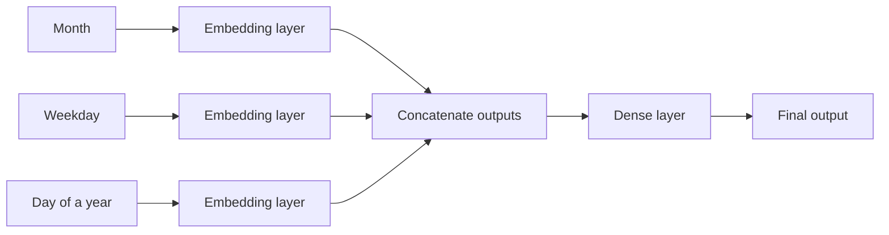

Tags: [[__Machine_Learning]]

# Introduction
Feature embeddings are a method of converting variables ([[Types of variables used for creating ML models|link]]) into numeric vector representations which can be used as an input for a ML model. 

Those vector representations are dense vectors ([[Sparse vs Dense vectors|link]]) called 'embeddings', which can represent features and properties of a given variable or its relations to other variables.

Variables which we convert can be categorical (the most common case) or numeric. A numeric variable can be a tensor ([[Tensor|link]]) with any number of dimensions.

That's one of methods of converting categorical variables into numeric ([[Converting categorical variables into numeric ones|link]]).
# How to create embeddings
Embedding vectors are created by a ML model (embedding model) trained on a dataset from which it learns similarities and relations between variables. 

For categorical variables, the input for an embedding model can be either a sparse vector created using one hot encoding ([[Encoding categorical variables|link]]) or numbers representing categories.

For example, documents below explains how to create embeddings:
- For sentences - [[Sentence embeddings|link]] 
- For words - [[Word2vec (word embeddings)|link]] 
# Examples
For example words can be converted into dense vectors such that after replacing words with their vector representations the following equation might be true:
$\text{'king' - 'men' + 'women'} \approx \text{'queen'}$
Or words such as 'shoe' and 'boots' will have similar vectors.

We can also convert different categories into embeddings, for example categories like 'cat' and 'dog' will have more similar vectors than 'cat' and 'house', since they are both animals.

Days, months and days of a week can be converted into dense vectors such that Saturday and Sunday will have similar vectors since they are both days of a weekend, or public holidays might have similar vectors as well.
# Embeddings as an input for a model
## Non-sequential data
When we create embeddings for a non-sequential data, then model takes as an input embeddings for all the features at once.

We can:
- Pass as an input embeddings for each feature to a separate neural network layer and process them in parallel, independently
- Concatenate the output for each embedding input
- Pass the concatenated output to another layer

So the model architecture looks like this:

## Sequential data
When data is sequential, then there are two options:
- Model takes as an input embeddings for sequence elements one by one (e.g. a recurrent neural network layer)
- Model takes as an input embeddings for all the sequence elements at once (e.g. a Transformer model ([[Transformer model|link]]))

#MachineLearning 