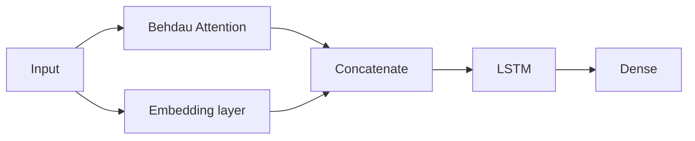

Tags: [[__My_projects]] [[__Machine_Learning]]
#MyProjects #MachineLearning 

# Introduction
In this project, we train a LSTM based sequence to sequence model (seq2seq) for creating sentence embeddings ([[Sentence embeddings|link]]) which can be used for a semantic search ([[Semantic search|link]]). 

This model consists of an encoder and a decoder. To train the encoder to create sentence embeddings, we train the seq2seq model like this:
- Model takes a sentence as an input
- The encoder produces an embedding (a vector) representing a meaning of that sentence
- The decoder tries to reproduce the same input sentence word by word using the embedding created by encoder

This way the encoder learns how to create an embedding of a sentence representing its meaning. It prepares such an embedding, that the decoder can use it to recreate the sentence.

Sentence embeddings created by the encoder can be used for a semantic search (similar sentences should have similar embeddings).
# Code repository
The repository with code for this project is here - [github.com](https://github.com/bulka4/semantic_search_lstm_seq2seq).
# Prerequisites
Before we start using code from this repo, we need a file with words and their embeddings, for example `glove.840B.300d.txt` which can be downloaded from [nlp.stanford.edu](https://nlp.stanford.edu/projects/glove/).
# Model
Model consists of an encoder and a decoder.

Encoder consists of two layers: Embedding (we use already created embeddings as an initial embeddings) and LSTM.

Decoder works like that:
- Input goes to:
	- The Bahdau attention layer, producing a context vector
	- The embedding layer
- The context vector is concatenated with the output of the embedding layer
- Concatenated vectors are an input for the LSTM layer
- Output of the LSTM layer is an input for the dense layer


We use LSTM and Bahdau Attention neural network layers.
## Creating word embeddings
We use a file `glove.840B.300d.txt` which contains already prepared words and their embeddings ([[Word2vec (word embeddings)|link]]). We don't create embeddings on our own (although we can modify those embeddings using the embedding layer we use in the encoder).

It can be downloaded from [nlp.stanford.edu](https://nlp.stanford.edu/projects/glove/).

File with embeddings we download can be huge. In order to create a new smaller file, only with words we need, we can use the `create_embedding_file` function.
# Training
During training, we:
- Take as an input a sentence
- Encoder produces an output for that sentence (an embedding, a vector representing a meaning of the input sentence)
- Decoder tries to reproduce the input sentence. It predicts words in the input sentence, word by word using as an input:
	- The encoder's output (embedding)
	- Words predicted so far

This way encoder learns how to convert a sentence into an embedding (a vector) representing a meaning of that sentence. It prepares such an embedding, that the decoder can use it to recreate the sentence.
## Data
Data used for training is a CSV file with different sentences which we are comparing how similar they are.
# Tensorflow code
Here is a high level overview of what Tensorflow code we use for defining and training models. We define our own custom model by creating a class which inherits from Tensorflow ([[Tensorflow - Creating a custom model as a subclass|link]]).
## Encoder and decoder classes
Encoder and decoder are separate classes:
```python
from tensorflow.keras.models import Model
from tensorflow.keras import layers
import tensorflow as tf

class Encoder(Model):
	...
	self.embedding = layers.Embedding(...)
	self.lstm = layers.LSTM(...)
	
	@tf.function
    def call(...)
	    x = self.embedding(x)
	    output, state_h, state_c = self.lstm(x)
        return output, state_h, state_c
        
class Decoder(Model):
	# Similar as the Encoder
	...
```

This way we can train them together but save and use after training separately.
## Training
For training we use the `tf.GradientTape()` function to calculate gradients and then we use those gradients and optimizer to update model's parameters:
```python
@tf.function
def train_step(...)
    with tf.GradientTape() as tape:
	    enc_output, enc_state_h, enc_state_c = encoder(input)
		for t in range(targ.shape[1]):
			# Make a prediction for the t-th element (word) in the target sequence
			# based on:
				# - dec_input - words predicted so far
				# - enc_output - output of the encoder
			prediction, dec_state_h, dec_state_c = decoder(
				dec_input
				,enc_output
				,...
			)
			
			 # Calculate loss by comparing the prediction to the t-th element in 
			 # the target sequence
			batch_loss += loss_function(targ[:, t], prediction)
            
            # Use as an input for the decoder for the next iteration all the 
            # elements (words) of the target sequence for which we made
            # a prediction so far
            dec_input = tf.expand_dims(targ[:, t], 1)
```