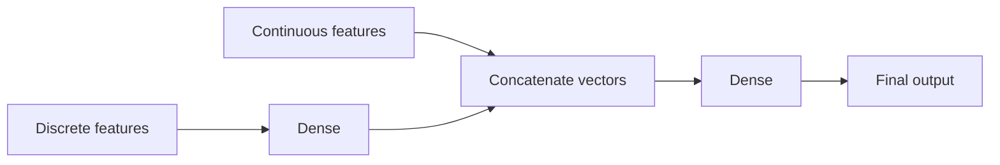
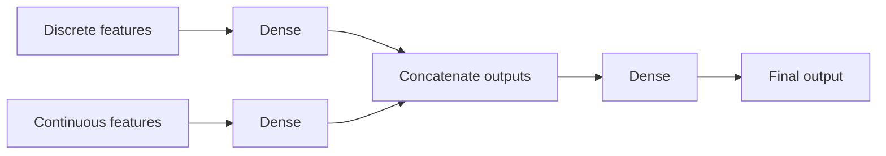

Tags: [[_My_projects]] [[__Machine_Learning]]
#MyProjects #MachineLearning 

# Introduction
In this project we create a model for predicting whether or not contacting a client as a part of a marketing campaign will be successful, i.e. a client will subscribe a term deposit.

We assume that the total campaign budget is fixed and we want to calculate an expected lift from using model predictions vs random selection.
# Code repository
Repository with the code is here - [github.com](https://github.com/bulka4/predicting_marketing_campaign_results).
# Model
An input for a model is a mix of continuous and discrete variables ([[Machine Learning - Mix of different types of input variables|link]]).

Model architecture we use is:
- A neural network dense layer which takes as an input discrete variables
- Output of the dense layer is concatenated with continuous variables
- Concatenated vectors are an input for the final dense layer

It looks like this:

## Alternative architecture
Alternatively, we can use this architecture:
- One neural network dense layer which takes as an input discrete variables and another one for continuous
	- Both layers process inputs in parallel and independently
- Outputs of both layers is concatenated
- Concatenated output is an input for the final dense layer

It looks like this:

## Programming in Tensorflow
We program the model in the `functions/model.py` script by creating a class which inherits from the Tensorflow `Model` class ([[Tensorflow - Creating a custom model as a subclass|link]]) and we create a custom training loop using the `tf.GradientTape()` function.
# Preparing a training dataset
## Dropping useless features
To check which features are useful for predicting the target variable we:
- Calculated:
	- chi square for discrete features 
	- correlation for continuous ones
- Reviewed bar plots and violin plots
## One hot encoding
We use one hot encoding ([[Encoding categorical variables - One hot encoding|link]]) to convert categorical features into discrete variables.
## Normalization
We use a normalization layer ([[Neural Network - Layer Normalization|link]]) to scale inputs.
## Imbalanced dataset
To deal with an imbalanced dataset ([[Training ML models on an imbalanced dataset|link]]), there is a few approaches described in subsections below. 

Currently, we use the method described in the "EasyEnsemble" section.
### EasyEnsemble
In the EasyEnsemble method ([[EasyEnsemble|link]]) we split the dataset into multiple smaller, balanced datasets.

For example, if in the original dataset 80% of samples have $y = \text{yes}$, then we split it into 5 datasets where in each one there is 50% of samples where $y = \text{yes}$ and 50% of samples where $y = \text{no}$.

Then, we train a separate model on each new dataset (we can also train a single model but usually that is less effective).
### Cluster-based ensemble
The Cluster-based ensemble technique ([[Cluster-based ensemble|link]]) is similar to the EasyEnsemble method ([[EasyEnsemble|link]]), we also split the original dataset into multiple, smaller, balanced datasets, but instead of randomly choosing samples for each new dataset, we perform clustering.

It works like that:
- Divide the majority classes into L distinct clusters. 
- Train L predictors, where each predictor is trained on:
	- Data samples from only one of the clusters
	- All of the data from the minority class
- To make the final prediction:
	- Each model makes a prediction
	- We take an average of all predictions
### Undersampling with cluster centroids
Undersampling data with cluster centroids ([[Undersampling with cluster centroids|link]]) is a method where we:
- Take all the samples which belong to the majority class and cluster them using for example K-Means ([[K means clustering|link]]) to group them into $k$ clusters.
- All the samples from each cluster is then replaced with their cluster centroids.
### Random oversampling and undersampling
Use Random oversampling ([[Random Oversampling|link]]) and undersampling ([[Random Undersampling|link]]) to remove some rows with zeros or duplicate rows with ones.
### Modify loss function
We can use:
- A focal loss function ([[Focal loss|link]]) - which assigns higher loss value to samples for which model predicts small probability. In an imbalanced dataset, model is usually assigning smaller probabilities to a minority-class samples.
- Class Weights - Cost-Sensitive Learning ([[Class Weights - Cost-Sensitive Learning|link]]) - Assign explicitly higher weights to the minority class samples to make the model focus more on making a correct predictions for them.
### Treat it as anomaly detection
We can use techniques for anomaly detection ([[Anomaly Detection models|link]]) to detect when a campaign is successful.
# Choosing a decision theshold
## ROC graph
We create a ROC graph ([[ROC-AUC for evaluating ML models|link]]) to choose the best decision threshold ([[Decision - classification threshold|link]]).
## Choosing threshold to maximize precision
There is also another way to choose the best threshold. We will be using this model in such a way that we take all the data about clients, predict if they will subscribe and we will call to all those clients for who model predicted that they will subscribe. 

Now the question is how many of them will the most probably actually subscribe? We have a fixed budget, let’s say that we want to call about 18000 clients as previously, so we want our model to find around 18000 clients that will subscribe and we want to have as high precision as possible. 

How many positives our model will predict (how many clients will subscribe) and precision depends on what threshold we will choose. I have noticed that lower threshold causes that the model has a higher precision but it less often predicts positives. 

So if for example we will see that for our dataset model predicts 30 000 positives we can lower a threshold because we won’t call all 30 000 clients, we will call just 18 000 of them and with a lower threshold we will have a higher precision. 

So what I did is:
- At first, I have calculated a precision for different thresholds using dataset with clients from a campaign group. 
- Then, I have used my model to make predictions using different thresholds for a whole dataset with all clients from both campaign and control group. 
- I have checked number of predicted positives (client will subscribe) for a whole dataset and I calculated estimated number of true positives using precision which I calculated previously (estimated number of true positives = precision * number of predicted positives). For example if I see that the model predicted 10 000 positives for a whole dataset and I know that precision = 25% then estimated number of true positives will be 2500. 
