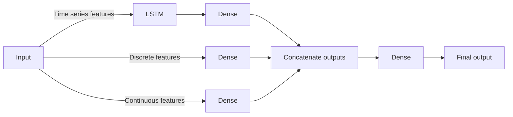

Tags: [[_My_projects]] [[__Machine_Learning]]
#MyProjects #MachineLearning 

# Introduction
In this project we create two models for predicting a revenue for the next months a client will generate.

For building a model we use neural network layers: LSTM and Dense. 

Input for a model consists of 3 types of variables ([[Machine Learning - Mix of different types of input variables|link]]): continuous, discrete and time series. Each type is processed by a separate layer in parallel and results are then concatenated and processed through another layer.

Model is programmed using Tensorflow by creating a custom model class and training loop.

We test different models:
- Classification - predict revenue cluster (with a specific range e.g. 1mln - 2mln)
- Regression - predict an exact revenue
- Classification plus regression ([[Machine Learning - Combining a classification and regression models for a regression task|link]]) - First predict a revenue cluster, then use this cluster as an input for the regression model and predict an exact revenue
# Code repository
Repository with the code for this project - [github.com](https://github.com/bulka4/ml_customer_lifetime_value).
# Models
We test different models:
- Classification - predict a future revenue cluster (with a specific revenue range e.g. 1mln - 2mln)
- Regression - predict an exact revenue
- Classification plus regression:
	- First the classification model predicts a future revenue cluster
	- Then, the regression model predicts an exact revenue based on the predicted future revenue cluster
	- There are a few options for how to train a model for regression:
		- Train one model for all the future revenue clusters
		- Train a separate model per each future revenue cluster
## Architecture
Both models for classification and regression use the same architecture.

Model takes as an input continuous, discrete and time series features described in the "Features" section in this document.

Different kinds of features are an input for different neural network layers:
- LSTM for time series (followed by the Dense layers)
- One Dense layer for discrete and another one for continuous

Each layer processes inputs in parallel, separately, and outputs of each layer are concatenated:

## Programming the model with Tensorflow
Model is programmed using Tensorflow by creating a custom model class ([[Tensorflow - Creating a custom model as a subclass|link]]). Code looks like that (a simplified view):
```python
import tensorflow as tf

class Model(tf.keras.layers.Layer):
	def __init__(...):
		# Add LSTM layer
		self.lstm = tf.keras.layers.LSTM(...)
		
		# Add Dense Layer which will process output of the LSTM layer
		for no_neurons, activation in ...:
			self.timeSeriesLayers.append(tf.keras.layers.Dense(...))
		
		# Add Dense Layer which will process discrete features
		for no_neurons, activation in ...:
			self.discreteLayers.append(tf.keras.layers.Dense(...))
		
		# Add Dense Layer which will process continuous features
		for no_neurons, activation in ...:
			self.continuousLayers.append(tf.keras.layers.Dense(...))
		
	def call(self, x_discrete_features, x_continuous_features, x_time_series):
        x_time_series = self.lstm(x_time_series)
        
        for layer in self.timeSeriesLayers:
            x_time_series = layer(x_time_series)
        
        for layer in self.discreteFeaturesLayers:
            x_discrete_features = layer(x_discrete_features)
            
        for layer in self.continuousFeaturesLayers:
            x_continuous_features = layer(x_continuous_features)
        
        x = tf.concat([x_time_series, x_discrete_features, 
	        x_continuous_features], axis = 1)
        
        for layer in self.finalLayers:
            x = layer(x)
            
        return x
```
### Training function
For training, we create a custom training loop. Code looks like that (again simplified view):
```python
def train_step(...):
	with tf.GradientTape() as tape:
        prediction = model(x_discrete_features, x_continuous_features, 
	        x_time_series)
        loss = loss_function(y, prediction)
            
    variables = model.trainable_variables
    gradients = tape.gradient(loss, variables)
    optimizer.apply_gradients(zip(gradients, variables))
    
    return loss
    
    
def trainModel(model, ...):
	x_batch = ...
	y_batch = ...
	epoch_loses = []
    for epoch in range(epochs):
	    batch_loss = train_step(x_batch, y_batch, ...)
	    batch_losses.append(batch_loss.numpy())

	epoch_loses.append(batch_loss.numpy())
	
	return model, epoch_loses
```
# Features
Features used for the model:
- Continuous:
	- number of sales
	- frequency (how often a client was ordering)
	- recency (number of days since the last purchase)
	- total revenue
- Discrete:
	- clustered continuous features (more info in the next section)
- Time series
	- Revenue from the past for different time intervals (e.g. from the previous month, two months ago, three months ago etc.)

All the features are an input into a single model.
## Using clustering to create discrete features
We use clustering to create discrete features from continuous ones ([[Feature engineering - Converting continuous features into discrete|link]]). We use for that k-means clustering an each cluster contains values from a specific range.

For example, for the feature "number of sales", we can create clusters where:
- 0 <= "number of sales" < 100
- 100 <= "number of sales" < 200
- 200 <= "number of sales" < 300

We assign numbers to clusters and those cluster numbers are an input for a model.

Clusters are ordered, i.e. clusters with higher numbers contains samples with higher or lower values.
## Overall score feature
We can combine frequency and revenue clusters to create another feature called overall score. For example if one client has frequency cluster = 1 and revenue cluster = 2 then overall score can be sum of those cluster = 2 + 1 = 3
# Data preparation
Data for this project was taken from a private SQL database. The SQL queries used are not a part of this repository.
## Scaling
We use a min-max scaling ([[Feature scaling|link]]) for continuous and time series features.
## Dropping uncorrelated features
We are dropping features which are uncorrelated ([[Feature engineering - Dropping uncorrelated features|link]]) with the target variable we want to predict (columns where correlation is smaller than a specific threshold).
## Removing outliers
We remove outliers ([[Training datasets for ML models - Outliers|link]]) from the training dataset, i.e. we remove a small part of data samples with values significantly different than the rest. We remove outliers for every client separately.

Thanks to this, it might be easier for the model to capture patterns which are common because those outliers might not match those patterns.

Because of that, model can be worse when it comes to detecting such outliers but overall performance will be better since number of outliers is very small.
## Imbalanced dataset
There is a problem with imbalanced dataset ([[Training ML models on an imbalanced dataset|link]]). We can remove some of the outliers and also we can create a few separate datasets.

If we have for example 2000 clients for the first future revenue cluster, 400 for the second one and 100 for the third one then we can create four datasets where each dataset contains 500 clients for the first future revenue cluster, 400 for the second one and 100 for the third one.

After creating a few separate datasets we can train one model on those datasets one by one or we can train multiple models each on a different dataset. If we train multiple models then in order to make final predictions on a new dataset we are making predictions using all the models and taking the average or maximum of all models’ outputs.

For now it looks like training one model on all subsets gives similar results as training different models for each subset and taking the average of all models’ outputs.
# Model evaluation
To evaluate the model we use:
- Accuracy
- Confusion matrix (the script `modelClassificationTraining.py` saves it as a heatmap image)
# Ideas to test
## Comparing how similar are clients features
To detect outliers ([[Anomaly Detection models|link]]):
- Use cosine similarity or other metric to compare how similar are clients features
- Clients with similar features might have similar future revenue
## Autoformer model
Another option (not tested) is to use an Autoformer ([[Autoformer|link]]) model to predict a sequence of numbers which represents revenue in the following months (the length of that sequence might be fixed but it doesn’t have to be. Model can also try to predict how long is that sequence, when does it stop)
## BG/NBD and Gamma-Gamma models
We can use BG/NBD and Gamma-Gamma models to model how frequently customers will be buying products and how much money they will spend in each transaction ([[Machine Learning - Event frequency and magnitude modeling|link]]):
- Use BG/NBD model to predict number of transactions in the future.
- Use Gamma-Gamma model to predict an average profit per transaction.
- More information about this method is here - [kaggle.com](https://www.kaggle.com/code/kemalgunay/cltv-customer-lifetime-value-method).
## Different options of model’s outputs
Test different options of model’s outputs:
1) Predicted total value of sales orders for some time period (a single number)
2) Predicted  total value of sales orders for next n months: $\large [y_1, …, y_n]$ where n is fixed
3) Predicted total value of sales orders for next n months: $\large [y_1, …, y_n]$ where n is gonna be predicted by a model. So model will not only predict a total value of sales orders for each month but also for how many months a given client will be generating a revenue.
# Useful materials
- [kaggle - clv prediction](https://www.kaggle.com/code/shailaja4247/customer-lifetime-value-prediction/notebook) 