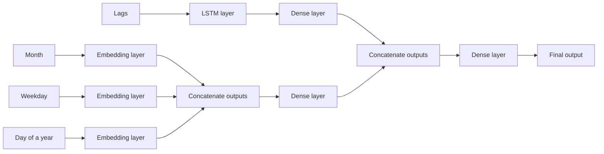

Tags: [[__My_projects]] [[__Machine_Learning]]
#MyProjects #MachineLearning 

# Introduction
In this project we build a model for predicting number of words received from clients by a company for translation.

As features ([[Time series data - Feature engineering|link]]) we use only:
- Time features (month, weekday, day of a year)
- Lags (words received in previous days)

For time features we use an embedding layer which converts those features into embeddings (similarly like it is done for word embeddings ([[Feature embeddings|link]])).
# Code repository
Repository with the code for this project is here - [github.com](https://github.com/bulka4/ml_words_received_prediction).
# Model architecture
Model architecture looks like this:

# Programming the model with Tensorflow
Model is programmed using Tensorflow by creating a custom model class ([[Tensorflow - Creating a custom model as a subclass|link]]). Code looks like that (a simplified view):
```python
import tensorflow as tf

class Model(tf.keras.layers.Layer):
	def __init__(...):
		# Add LSTM layer
		self.lstm = tf.keras.layers.LSTM(...)
		
		# Add Dense Layer which will process output of the LSTM layer
		for no_neurons, activation in ...:
			self.timeSeriesLayers.append(tf.keras.layers.Dense(...))
		
		# Embedding layers for tie features - month, weekday, day of a year
		self.embeddingMonth = tf.keras.layers.Embedding(...)
		self.embeddingWeekday = tf.keras.layers.Embedding(...)
		self.embeddingYearday = tf.keras.layers.Embedding(...)
		
		# Add Dense Layer which will process time features (output of Embedding
		# layers)
		for no_neurons, activation in ...:
			self.timeFeaturesLayers.append(tf.keras.layers.Dense(...))
		
		# Add Dense Layer which will process output of time features and
		# time series layers to generate the final output
		for no_neurons, activation in ...:
			self.finalLayers.append(tf.keras.layers.Dense(...))
		
	def call(self, x_categorical_features, x_continuous_features, x_time_series):
        x_time_series = self.lstm(x_time_series)
        
        for layer in self.timeSeriesLayers:
            x_time_series = layer(x_time_series)
        
        month_vec = self.embeddingMonth(x_time_features[:, 0])
        weekday_vec = self.embeddingWeekday(x_time_features[:, 1])
        yearday_vec = self.embeddingYearday(x_time_features[:, 2])
        
        x_time_features = month_vec + weekday_vec + yearday_vec
        
        for layer in self.timeFeaturesLayers:
            x_time_features = layer(x_time_features)
        
        # concatenate output from timeSeriesLayers with an input with continuous 
        # features
        x = tf.concat([x_time_features, x_time_series], axis = 1)
        
        for layer in self.finalLayers:
            x = layer(x)
            
        return x
```
### Training function
For training, we create a custom training loop. Code looks like that (again simplified view):
```python
def train_step(...):
    with tf.GradientTape() as tape:
        prediction = model(x_time_features, x_time_series)
        loss = loss_function(y, prediction)
            
    variables = model.trainable_variables
    gradients = tape.gradient(loss, variables)
    optimizer.apply_gradients(zip(gradients, variables))
    
    return loss
    
    
def trainModel(model, ...):
	epoch_loses = []
	for epoch in range(epochs):
		for batch_number in ...:
			x_time_features_batch = ...
			x_time_series_batch = ...
			y_batch = ...
			
			batch_loss = train_step(...)
			epoch_loses.append(batch_loss.numpy())
			
	return epoch_loses
```
# Data preparation
Data is taken from a private SQL database. The SQL queries used are not included in this repository.
## Removing outliers
We remove outliers ([[Training datasets for ML models - Outliers|link]]) from the training dataset, i.e. we remove a small part of data samples with values significantly different than the rest.

Thanks to this, it might be easier for the model to capture patterns which are common because those outliers might not match those patterns.

Because of that, model can be worse when it comes to detecting such outliers but overall performance will be better since number of outliers is very small.