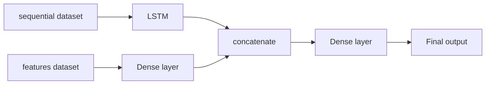

Tags: [[__Machine_Learning]]

# Introduction
There are different types of time series datasets we can use as an input for a model and different model architectures for handling them:
- A single sequence
- Multiple samples with sequences
- Multiple samples with sequences of numbers plus static features
- Multiple samples with sequences of numbers plus dynamic features
# A single sequence
When using time series data for training ML models, we might have a dataset with a single sequence. For example, that can be temperature measurements from the past and we want to predict a temperature in the future.

We need to convert it into a training dataset of shape $(n, k)$ for a model, where:
- $n$ - Number of data samples
- $k$ - Number of features per sample

We can do this by converting each value in the sequence into a separate data sample. So if our sequence has length $T$ (that is amount of timesteps), then we receive a training dataset of shape $(T, 1)$, where sequence values are the only feature (e.g. temperature measurements).

We can create additional features for each timestep, for example:
- Lags - The last $n$ values from the past - $x_{t-1}, ..., x_{t-n}$
- Rolling statistics - average or maximum from the last $n$ timestamps
- Calendar features - day of week, month, holiday indicator

More features are mentioned in the 'Feature engineering techniques' section further in this document.

After adding more features, our training dataset changes its shape into $(T, F)$ where $F$ is a number of features.

So a single input for a model is a 1-D tensor of shape $(F)$ and we have $T$ data samples. Or it can be also represented as a 2-D or 3-D tensor of shape $(F, 1)$ or $(F, 1, 1)$ .

This way, a single sequence can generate many supervised data samples suitable for classical ML models.

More examples are here: [analyticsvidhya.com](https://www.analyticsvidhya.com/blog/2019/12/6-powerful-feature-engineering-techniques-time-series/#h-feature-engineering-for-time-series-6-domain-specific-features)
# Multiple samples with sequences
We can have multiple data samples with a separate sequences, for instance each sample might contain measurements from sensors and we want to classify each measurement. 

That means our dataset has a shape $(n, T)$, where:
- $n$ - Number of samples
- $T$ - Number of timestep in each sample sequence

So a single input for a model is a 1-D tensor of shape $(T)$ , or it can be also represented as a 2-D or 3-D tensor of shape $(T, 1)$ or $(T, 1, 1)$ .
# Multiple samples with sequences of numbers plus static features
Another option is that we have a dataset with multiple samples with sequences and additionally static (non-time-varying) features for each sequence.

For example, predicting total revenue of customers based on sales data:
- Each sample is a specific period for a specific customer
- Sequence values correspond to daily sales
- Static features might include customer's country, company size, industry, etc. 

Then we can represent it as two datasets:
- A 'sequential dataset' with sequences (sales) values of shape $(n, T)$
- A 'features dataset' with static features of shape $(n, F)$
where:
- $n$ - Number of samples
- $T$ - Sequence length (number of timesteps)
- $F$ - Number of features

In that case we can use samples from different datasets as an input for different models, for example:
- Sample from the 'sequential dataset' is an input for a LSTM Neural Network layer
- Sample from the 'features dataset' is an input for a Dense Neural Network layer

So we have an input for the model for sequential data of shape $(T)$ which again can be represented also as 2-D and 3-D tensors of shapes $(T, 1)$ and $(T, 1, 1)$. Similarly, input for the model for static features will have shape $(F)$, $(F, 1)$ or $(F, 1, 1)$ .

Once LSTM and Dense layer generates an output for their separate inputs, we combine them and use as an input for another model (e.g. another Dense layer) which makes the final prediction:

# Multiple samples with sequences of numbers plus dynamic features
If features in our time series dataset are not static but dynamic (time-dependent), then it needs to be represented as a single dataset of shape $(n, T, F)$, where:
- $n$ - Number of samples
- $T$ - Sequence length (number of timesteps)
- $F$ - Number of features

So a single input for a model will have shape $(T, F)$ or $(T, F, 1)$ .

Dynamic feature values change over time, i.e. for each timestamp in a sequence we have different feature values.

An example of such a dataset is the one with measurements of a temperature in different places on earth on different days. 

Each sample contains measurements for a specific region and time. Features might include both:
- Static features, e.g. geographical coordinates of the region
- Dynamic features - e.g. day of the year, humidity

This dataset needs to be passed as an input into a single sequential model, such as RNN, 1d CNN or Transformer, which can handle time-dependent features directly.

#MachineLearning 