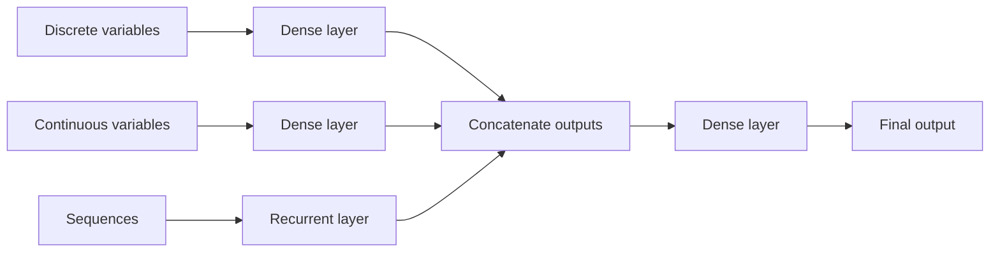
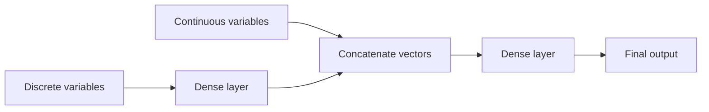

Tags: [[__Machine_Learning]]

# Different neural networks layers for different types of inputs
When input for a model is a mix of different types of variables (e.g. categorical, continuous or time series (a sequence) ([[Types of variables used for creating ML models|link]])), then we can:
- Pass different types of variables as an input to different neural network layers which process them simultaneously and independently
- Outputs of different layers are concatenated together
- Concatenated output is processed by another layer

So then, the model architecture looks like this:

# Concatenating output of a layer for discrete variables with continuous variables
We can also concatenate an output of a dense layer for for discrete variables directly with continuous variables:

# Decision tree
Also, a Decision tree model can handle such a mix of different kinds of variables.

#MachineLearning 