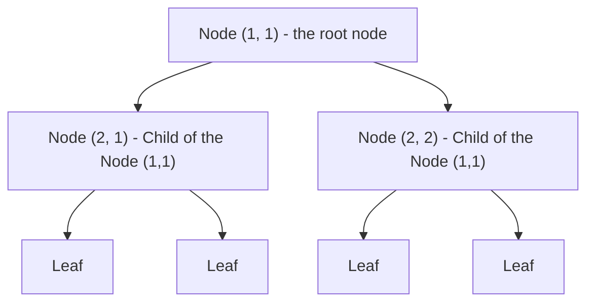

Tags: [[__Machine_Learning]]

# Introduction
Parallel sampling is a technique used when generating tokens ([[Token generation|link]]) which allows to generate multiple sequences in parallel.

It is used for:
- Getting several possible answers
- Speeding up search (e.g., for best-of-N sampling)
- Supporting speculative decoding

It works because GPUs can process many sequences in parallel at nearly the same cost as processing one.
# How it works
We need to choose number of samples N.

***1. Generate the first token***
Model outputs a probability distribution, which describes for every token, how likely is that token to be the first token.

Using that distribution, we randomly select one token per sample.

***2. Next token***
Now each sample has different context (they contain different tokens generated so far). For every sample, model generates the next token (it might be the same for different samples, but probably they will be different since the context is different).

***3. Repeat***
Continue generating further tokens like in the step 2.
# Batch sampling
A batch sampling is an approach for parallel sampling, where we generate multiple sequences in parallel as a batch (a group of sequences).
# Tree sampling
A tree sampling is an approach for parallel sampling, where we explore multiple possible sequences in a tree structure:

It works similar to a beam search ([[Token generation - Beam Search|link]]).

Each node corresponds to a token, and child nodes correspond to possible next tokens sampled probabilistically (selected randomly using probability distribution defined by the model).

In beam search, when choosing the next token, we select top K most likely tokens. In tree sampling, we select randomly K tokens, they don't have to be the most likely ones.

#MachineLearning 